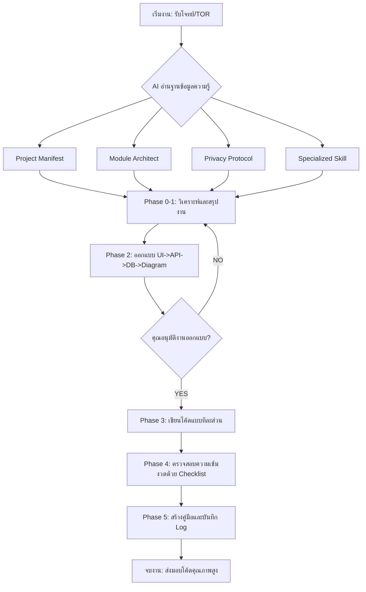

# 📘 AI-Augmented SDLC Master Guide
"เปลี่ยนการเขียนโปรแกรมด้วย AI แบบเดิมๆ ให้เป็นระบบวิศวกรรมเต็มรูปแบบ"

---

## 🏗️ 1. ผังการทำงานระบบ (The Workflow Diagram)

---

## 🚀 2. ขั้นตอนการเริ่มต้น (Quick Start Manual)

หลังจากที่คุณก๊อปปี้เทมเพลตนี้ไปวางในโปรเจกต์ของคุณแล้ว ให้ทำตามลำดับนี้ครับ:

### Step 1: ปรับแต่งห้องเครื่อง (Engine Setup)
- เข้าไปที่ `project_manifest.md` เพื่อตั้งชื่อโปรเจกต์ และเลือก `project_scale` ("Small" สำหรับงานไว, "Enterprise" สำหรับงานคุณภาพสูง)
- ตรวจสอบ Tech Stack ว่าตรงกับสิ่งที่คุณใช้จริงหรือไม่

### Step 2: ป้อนความต้องการ (Input Specs)
- วางไฟล์ TOR, รูปวาดหน้าจอ หรือคำอธิบายงานไว้ที่โฟลเดอร์ `docs/specs/`
- หากมีคำศัพท์เฉพาะทาง ให้ไปบันทึกที่ `.ai-system/context/domain-glossary.md`

### Step 3: คำสั่งเริ่มรันระบบ (The Activation Prompt)
พิมพ์คำสั่งนี้ในแชท AI เป็นคำสั่งแรก:
> "อ่านโปรเจกต์นี้และทำหน้าที่เป็น Senior AI Developer ตามมาตรฐานที่วางไว้ในไฟล์ .cursorrules และช่วยสรุปสถานะปัจจุบันจาก .ai-system/context/active-context.md ให้ฉันฟังหน่อย"

### Step 4: การทำงานรายวัน (Daily Work)
- **การสั่งงาน:** สั่งด้วยโมดูลเสมอ เช่น "เริ่มงานในโมดูล User Management: [สิ่งที่ต้องการทำ]"
- **การตรวจสอบ:** เมื่อ AI ออกแบบเสร็จ ให้ตรวจ UI และ API ก่อนพิมพ์ว่า "อนุมัติ"
- **การปิดงาน:** เมื่อ AI ทำเสร็จ ให้สั่งว่า "ทำ Closing Phase ตาม SOP ด้วย" เพื่อให้มันเขียนคู่มือและ Log ให้เอง

---

## 🔒 3. กฎทองความปลอดภัย (Security Golden Rules)

เพื่อให้ข้อมูลคุณไม่รั่วไหลไปถึงเซิร์ฟเวอร์ภายนอกแบบข้อมูลดิบ:
1. **Marking First:** ใช้ `{{SECRET}}` หรือ `[MASKED]` ทุกครั้งที่พิมพ์ข้อมูลสำคัญในแชท
2. **Local Secrets:** ข้อมูลความลับจริงให้ใส่ที่ไฟล์ `.env` ในเครื่องคุณเท่านั้น

---

## 🛠️ 4. วิธีเพิ่มโมดูลใหม่ในอนาคต
หากคุณต้องการเพิ่มโมดูลที่ 6, 7, 8...
1. สร้างโฟลเดอร์ใหม่ใน `.ai-system/modules/`
2. สร้างไฟล์ `expert.md` (กำหนดบทบาท) และ `shortcuts.md` (บอกจุดสำคัญ)
3. ระบบจะ Auto-Detect และ AI จะฉลาดขึ้นทันทีในโมดูลใหม่นั้น

---
*จัดทำโดย: AI-Augmented SDLC Team* 🚀
